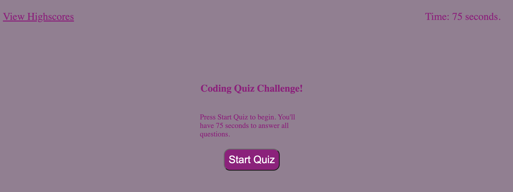
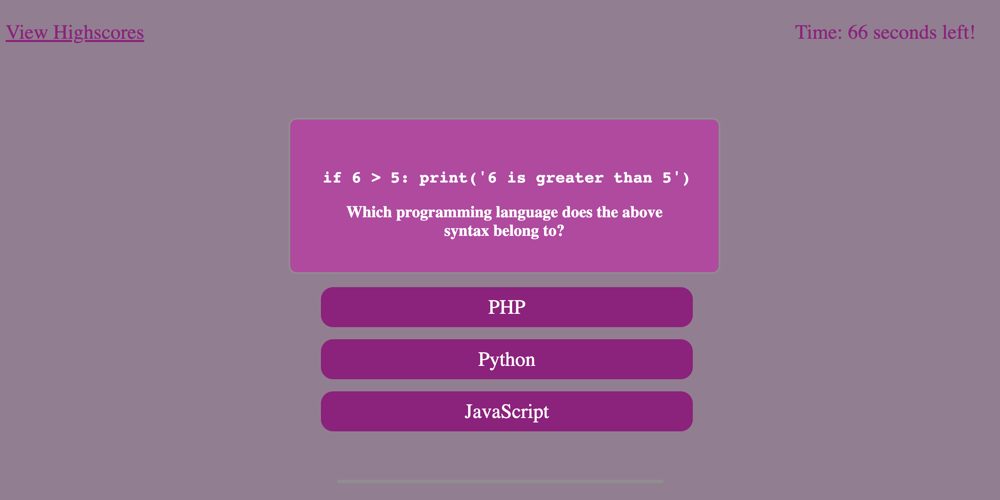
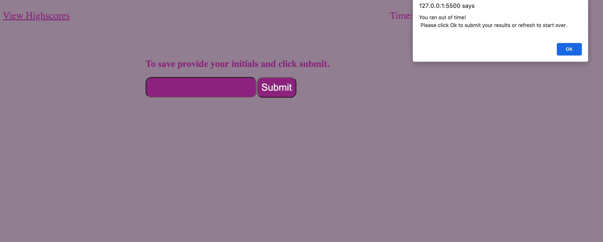
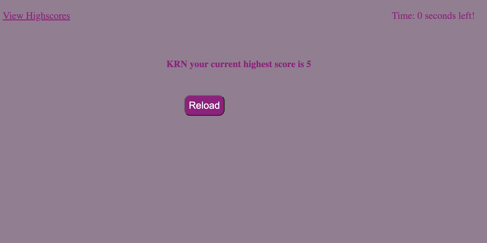

[# Homework Week IV Code Quiz Single Page App](https://rkutsel.github.io/js-dom-code-quiz/)

## Description

Another homework and another attempt to make the one page app look similar to the mock-up from the user story. My approach was to hae a bare bones HTML with no elements defined. All the heavy-lifting is done in JS (JavaScript). I did that in order to demonstrate JS abilities and how it all can be self-contained. I used various DOM [selection methods](https://www.javascripttutorial.net/javascript-dom/javascript-queryselector/) to demonstrate different ways to query objects and how they can be further manipulated. Also used different styles to listen to events and do actions on them. It's worth saying that this is not the best approach and more of a round-about method to achieve user-story objective. However this approach was chosen to show different sides of JS for the sake of demonstration. [Live Page](https://rkutsel.github.io/js-dom-code-quiz/)

## User Story

```
AS A coding boot camp student
I WANT to take a timed quiz on JavaScript fundamentals that stores high scores
SO THAT I can gauge my progress compared to my peers
```

## Acceptance Criteria

Here are the critical requirements necessary to develop a portfolio that satisfies a typical hiring manager’s needs:

```
GIVEN I am taking a code quiz
WHEN I click the start button
THEN a timer starts and I am presented with a question
WHEN I answer a question
THEN I am presented with another question
WHEN I answer a question incorrectly
THEN time is subtracted from the clock
WHEN all questions are answered or the timer reaches 0
THEN the game is over
WHEN the game is over
THEN I can save my initials and my score
```

## My Own Mock-Up






## Original Quiz Mock-Up


